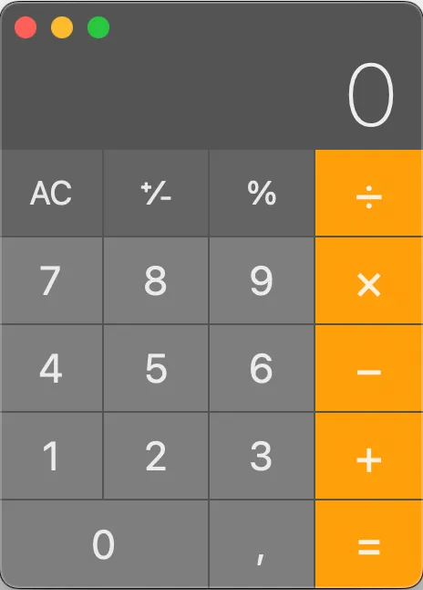

# Caclulator App - PyQt6 - Python 🐍

### System Requirements 🖥️
- Operational System: Linux/Windows
- GUI Framework: PyQt6 (QtDesigner)
- Python module: PyInstaller (create an .exe)

## Instalation 🌐

- #### Clone the project
-       $ git clone https://github.com/bentogomes19/CalculatorGUI.git

### Here we have two options. (1. Create an executable or run by the terminal (Linux/Windows))

### Create an executable
##### Certify that you have python installed first.
.

#### 1.1 Install PyInstaller
        $ pip install pyinstaller
    
#### 1.2 Create the executable
        $ pyinstaller --onefile --windowed --named Calculator main.py
    
#### 1.3 Go to /dist
        $ your executable will be create on dist folder

#### 1.4 run the "Calculator.exe"
        
#### 2. Executing by the terminal
##### Certify that you have python installed first.

#### 2.1 Open your terminal (Windows: CMD / Linux: Terminal/Console)
    
#### 2.2 After cloned the project go to the folder where the project was downloaded.
            $ cd /home/usr/calculator/
#### 2.3 First of all, check that you have python installed and check your version
            $ python --version
#### 2.3 Run the python file main.py
            $ python main.py

### Funcionalities
In this calculator we have the basics operations like sum, subtraction, division and multiplication
- You can convert a number in percetual
- You can clear the display
- You can change the signal of the number (+/-)

### Layout 

- This repository have 309,2 MB

Author: Bento Gomes.

